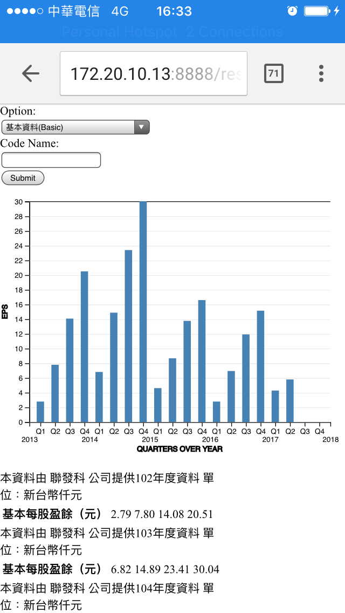

# TWSE Crawler

## Demo


#### Public data: [**TWSE**](http://mops.twse.com.tw/mops/web/index)

#### A micro python web application framework: [**Flask**](http://flask.pocoo.org/)
```sh
FLASK_APP=server.py flask run --port=8888 --host=0.0.0.0
```

#### A Python library for pulling data out of HTML and XML files: [**Beautiful Soup**](https://beautiful-soup-4.readthedocs.io/en/latest/#)
